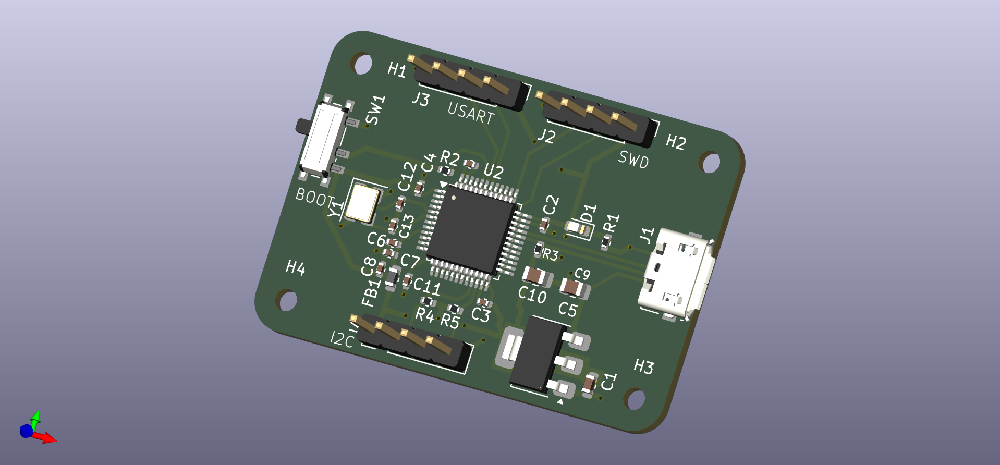

# STM32 PCB — KiCAD 9.0

**Compact 2-layer STM32-based PCB**

This repository contains the KiCAD 9.0 project files, documentation and assets for a compact 2-layer PCB built around an STM32 microcontroller. The board is designed for manufacturability on standard FR4 (1.6 mm) and targets hobbyist / low-volume production.

**Resource**

[KiCad 6 STM32 PCB Design Full Tutorial - Phil's Lab](https://www.youtube.com/watch?v=aVUqaB0IMh4&pp=ygULS0lDQUQgU3RtMzI%3D)

<div align="center">

</div>


---

## Design specifications

* **Design software:** KiCAD 9.0
* **Microcontroller (MCU):** STM32 (schematic & part references in BOM)
* **Layers:** 2 (Top / Bottom)
* **Board dimensions:** **41 mm × 28.8 mm**
* **Substrate:** FR4, **1.6 mm** thickness
* **Files included:** KiCAD project files, schematic, PCB layout, Gerber export instructions, BOM
* **Protocols supported:** UART, I2C, SWD

---

## Repository layout

```
/ (repo root)
├─ README.md
├─ STM32.kicad_pcb
├─ STM32.kicad_sch
├─ STM32.kicad_pro
├─ STM32.kicad_prl              
├─ /Manufacturing/            # Generated Gerber + drill files (ready for fab) in zip, BOM in CSV
├─ /images/                   # Schematic + top/bottom/layers view images
│   ├─ schematic.png
│   ├─ top_view.png
│   ├─ bottom_view.png
│   └─ layers_view.png
```

---

## Schematic Sheet


---

## PCB View

**Top View**


**Bottom View**


**Layers View**


---

## BOM

Autogenerated BOM from KiCAD

| Reference       | Qty | Value          | Footprint                                                  | Datasheet                                                |
| --------------- | --- | -------------- | ---------------------------------------------------------- | -------------------------------------------------------- |
| C1              | 1   | 10u            | Capacitor_SMD:C_0603_1608Metric                            | ~                                                        |
| C2,C3,C4,C5,C11 | 5   | 100n           | Capacitor_SMD:C_0402_1005Metric                            | ~                                                        |
| C6              | 1   | 10n            | Capacitor_SMD:C_0402_1005Metric                            | ~                                                        |
| C7,C8           | 2   | 1u             | Capacitor_SMD:C_0402_1005Metric                            | ~                                                        |
| C9,C10          | 2   | 22u            | Capacitor_SMD:C_0805_2012Metric                            | ~                                                        |
| C12,C13         | 2   | 10p            | Capacitor_SMD:C_0402_1005Metric                            | ~                                                        |
| D1              | 1   | RED            | LED_SMD:LED_0603_1608Metric                                | ~                                                        |
| FB1             | 1   | 120R           | Inductor_SMD:L_0603_1608Metric                             | ~                                                        |
| H1,H2,H3,H4     | 4   | MountingHole   | MountingHole:MountingHole_2.1mm                            | ~                                                        |
| J1              | 1   | USB_B_Micro    | Connector_USB:USB_Micro-B_Molex_47346-0001                 | ~                                                        |
| J2,J3,J4        | 3   | Conn_01x04_Pin | Connector_PinHeader_2.54mm:PinHeader_1x04_P2.54mm_Vertical | ~                                                        |
| R1              | 1   | 1K5            | Resistor_SMD:R_0402_1005Metric                             | ~                                                        |
| R2              | 1   | 10k            | Resistor_SMD:R_0402_1005Metric                             | ~                                                        |
| R3,R4,R5        | 3   | 1k5            | Resistor_SMD:R_0402_1005Metric                             | ~                                                        |
| SW1             | 1   | SW_SPDT        | Button_Switch_SMD:SW_SPDT_PCM12                            | ~                                                        |
| REG_3.3V        | 1   | AMS1117-3.3    | Package_TO_SOT_SMD:SOT-223-3_TabPin2                       | http://www.advanced-monolithic.com/pdf/ds1117.pdf        |
| MCU             | 1   | STM32F103C8T6  | Package_QFP:LQFP-48_7x7mm_P0.5mm                           | https://www.st.com/resource/en/datasheet/stm32f103c8.pdf |
| Y1              | 1   | 16MHz          | Crystal:Crystal_SMD_3225-4Pin_3.2x2.5mm                    | ~                                                        |


---


